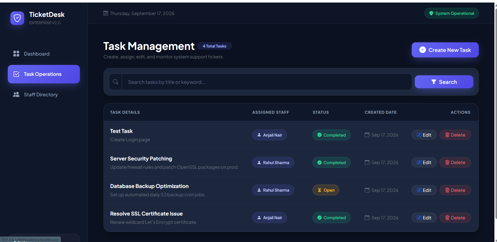
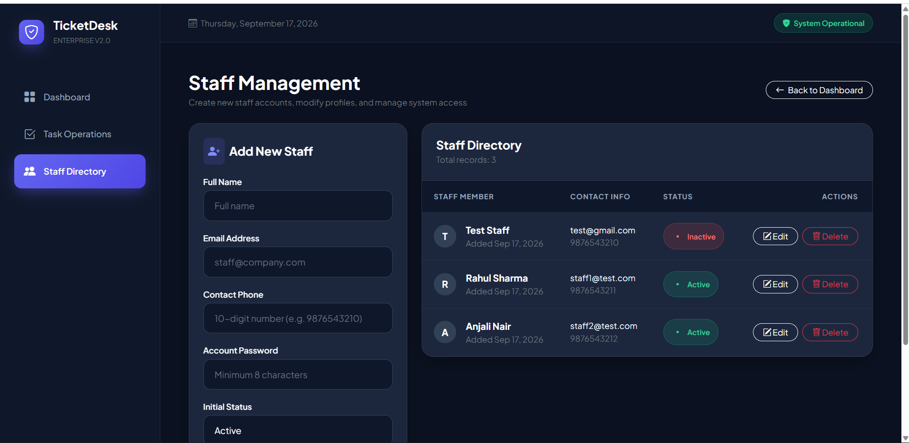
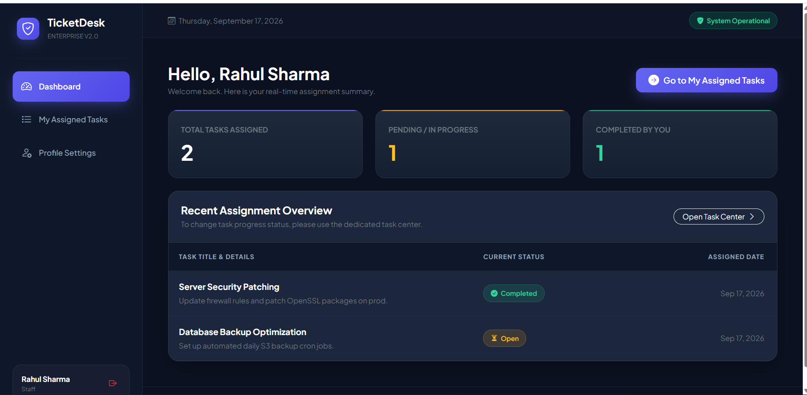
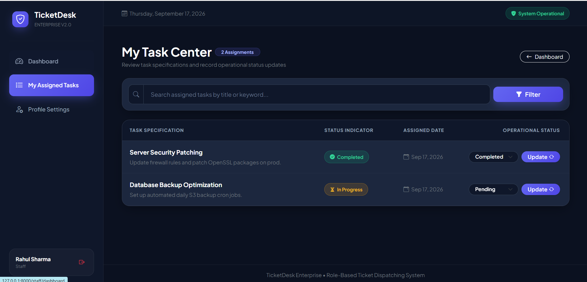
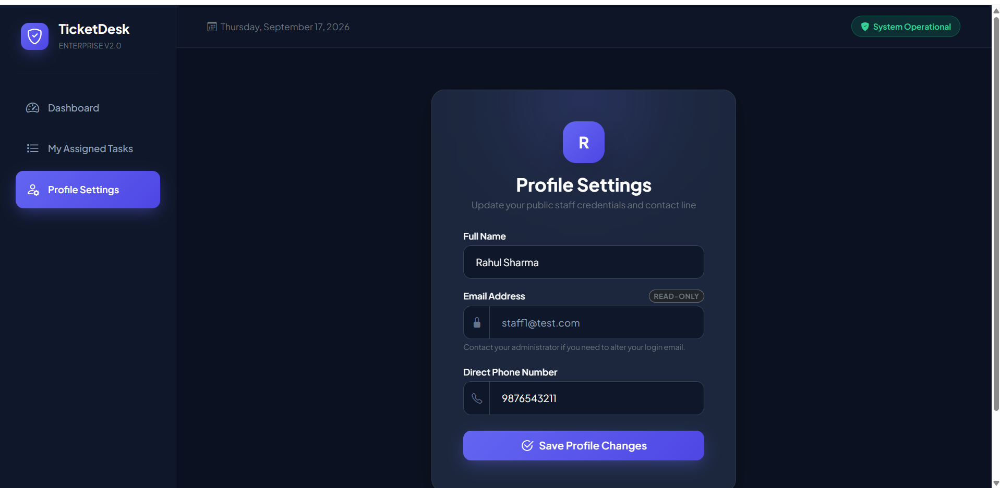

# TicketDesk Enterprise — Support & Task Dispatching System

A modern, role-based Ticket & Task Management System built with Laravel. The platform provides distinct portal workflows for Administrators and Staff members, validated data pipelines, soft-delete data safety, and a dedicated Sanctum REST API.

---

## Key Features

- **Role-Based Access Control (RBAC):** Explicit role separation (`admin` and `staff`) guarded via custom `role` route middleware.
- **Administrative Control Hub:**
  - Complete CRUD for staff management (create, update, soft-delete).
  - Task dispatching and reassignment across active staff members.
  - Real-time search by task title/keyword.
- **Staff Workspace:**
  - Overview metrics tracking assigned, pending, and completed tasks.
  - Fast, single-click inline operational status transitions (`Open` / `Completed`).
  - Self-service profile management with phone validation and locked login email.
- **Security & Validation:**
  - Strict unique email formatting via RFC/DNS checks.
  - Contact numbers strictly constrained to 10 numeric digits.
  - Minimum 8-character password enforcement.
- **Data Safety:** Laravel Eloquent `SoftDeletes` implemented across all primary records.
- **REST API Suite:** Laravel Sanctum token authentication with JSON responses covering listing, creation, and status dispatching.
- **UI/UX:** Dark slate theme with indigo glow accents and custom Bootstrap 5 scaffolding.

---

## Quick Setup & Installation

### 1. Prerequisites
- PHP >= 8.1
- Composer
- MySQL / MariaDB

### 2. Clone the Repository
```bash
git clone [https://github.com/PrajulVP/Ticket-Management.git](https://github.com/PrajulVP/Ticket-Management.git)
cd Ticket-Management
```

### 3. Install Dependencies
```bash
composer install
```

### 4. Environment Configuration
Copy `.env.example` to `.env`:
```bash
cp .env.example .env
```

Generate the application key:
```bash
php artisan key:generate
```

Configure your database credentials in `.env`:
```env
DB_CONNECTION=mysql
DB_HOST=127.0.0.1
DB_PORT=3306
DB_DATABASE=ticket_management
DB_USERNAME=root
DB_PASSWORD=
```

### 5. Run Migrations & Seeders
```bash
php artisan migrate:fresh --seed
```

### 6. Run the Application
```bash
php artisan serve
```

Access the application at `http://127.0.0.1:8000`.

---

## Default Login Credentials

| Role | Email | Password | Access Path |
| :--- | :--- | :--- | :--- |
| **Admin** | `admin@test.com` | `12345678` | `/login` -> Redirects to `/admin/dashboard` |
| **Staff** | `staff1@test.com` | `12345678` | `/login` -> Redirects to `/staff/dashboard` |

---

## API Reference Overview (Sanctum)

All API responses are formatted as standard JSON structures.

| Method | Endpoint | Description | Auth Required |
| :--- | :--- | :--- | :--- |
| `POST` | `/api/login` | Authenticate user & issue Bearer Token | No |
| `GET` | `/api/tasks` | List assigned tasks (supports pagination/search) | Yes (Bearer Token) |
| `POST` | `/api/tasks` | Create a new task (Admin role required) | Yes (Bearer Token) |
| `PATCH` | `/api/tasks/{id}/status` | Update operational status of assigned task | Yes (Bearer Token) |
| `POST` | `/api/logout` | Revoke current access token | Yes (Bearer Token) |

---

## Application Screenshots

### Admin Portal

#### Admin Task Operations & Management


#### Staff Directory & Registration


---

### Staff Portal

#### Staff Overview Dashboard


#### My Task Center (Status Transitions)


#### Staff Profile Settings


---

## License

This project is open-source software licensed under the [MIT license](https://opensource.org/licenses/MIT).